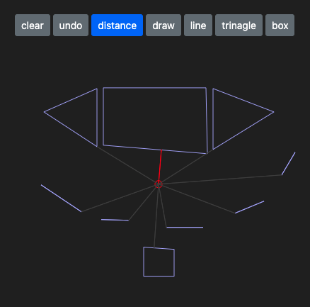

# SVG Draw Assignment

MVP SVG Drawing application in react.
2D geometry: [@flatten-js/core](https://github.com/alexbol99/flatten-js#readme)

> Based on :: ```react```, ```typescript```, ```webpack```, ```jest```, ```@flatten-js/core```



Until first technical issue this development going to made a requested drawing application. This issue was the ```line selection problem```. Because line is so thick to hard click on it. My basic ide was I do not any event listener directly to each SVG element, which is going to problematic by number of element.

I added ```flatten-js/core``` to the project. In that way I do not restrict to DOM elements. But able to based my interaction to ```geometry calculation```.

As ```distance``` function show in live to draw closest point of each polygon. Red one is the closest.

Another technical demo of this application is the ability to works as ```independent react component which``` one is do not have outer dependency.

Longer version: [Development story](./app/assignments/paint/__documents__/DEVELOPMENT_STORY.md)

## Prerequisite:
  - ```npm``` v8.1+
  - ```nodejs``` v17+
  - ```yarn``` v1.22+  (npm is enough)
  - ```serve``` (or any other static site serving alternatives)

## Terminal commands (bash, gitbash):

Prepare repo: ```yarn```

Hot reload develompent: ```yarn start```

Build:
```bash
yarn build
serve ./dist
```

Lint: ```yarn lint```

Test: ```yarn test```

Test Driven Development: ```yarn watch```