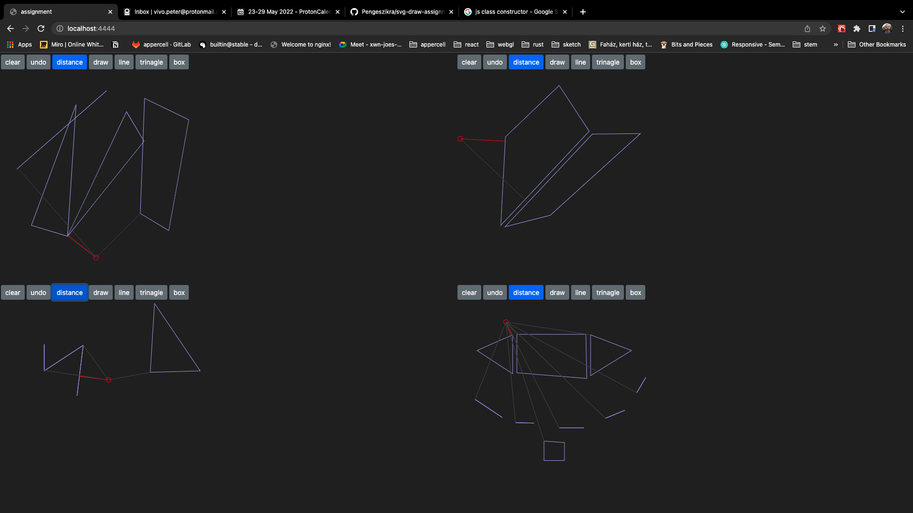

# SVG Drawing Component

## Road from base idea to full assignment

According my assignment request, I started gather background information, do some background research:

(best 20 drawing application)[https://financesonline.com/best-drawing-software/]

I was experience few of them: PhotoShop, Corel Draw, Krita, Adobe Illustrator. Saddly Flash do not have place in this list, but in my graphic designer experience that is the most loved one. 

(best 10 browser based vector drawing app)[https://www.makeuseof.com/tag/free-browser-adobe-illustrator-alternatives/]

As guest only Boxy SVG Editor is useful. It is do not ask any registration process, just instant test the application.

## Great Feature from different drawing application:
Because I used many of them, I have experience with drawing application as user.

  - **spline** (PhotoShop)
  - **complex vector fill** (Flash, AdobeIllustrator)
  - **frame by frame animation** (Flash)
  - **auto merging** (Flash)
  - **layer** (PhotoShop)
  - **art board** (PhotoShop) 
  - **blob** (boxy-svg)[https://boxy-svg.com/app]
  - **auto snap** (Adobe Illustrator)
  - **guide** (Concepts) 
  - **palets** (Concepts)
  - **UI rearange** (Concepts)
  - **color pick** (PhotoShop)RO
  
  - **snap** (Concepts) 
  - **timeLapse**

  This list is so huge! Ans I can add futher great features to 

## Key points

    - react based application
    - functional paradigm
    - works as independent react componens
    - outer API definitions on props
    - demo with multi component capability
    - can export svg code
    - mix: flatten.js and React
    - TDD

## Simple As Possible
SVG polygon element is fit for any shape drawing. Don't need specific syntax.

```jsx
  <polygon points={points} />
```

## Optimize
React.memo great for optimize rare changed element.

```jsx
const DrawedLayer:FC<{points:number[]}> = ({points}) => (
  <g stroke={DRAW_COLOR} fill="none">
    {points.map( (line, key) => <polygon points={line.toString()} key={key} />)}
  </g>
);

export const DrawedLayerCahce = memo(DrawedLayer);
```

## Worst Case
When I realised, the click action on svg polygon element is a quite messy. I going to flatt.js/core direction for a better solution. This decision also lead me to make something SVG independent solution behind the scene.


### Multi instance DEMO

```jsx
renderToAppId((
  <React.StrictMode>
    <MultipleExample amount = {4}/>
  </React.StrictMode>)
);
```

